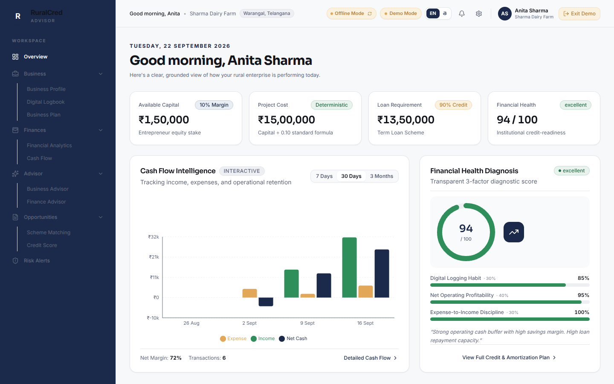
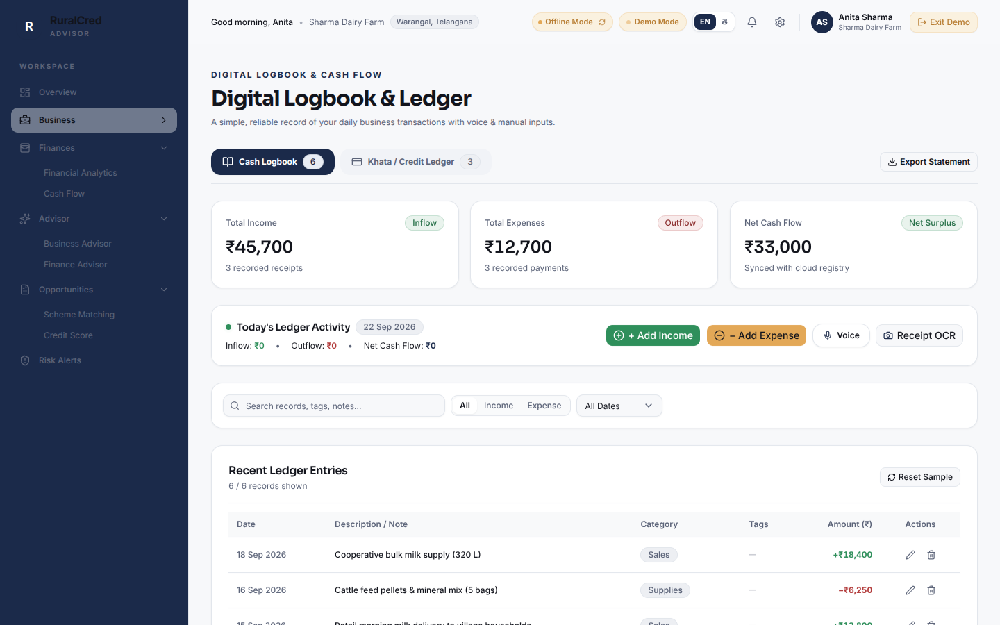
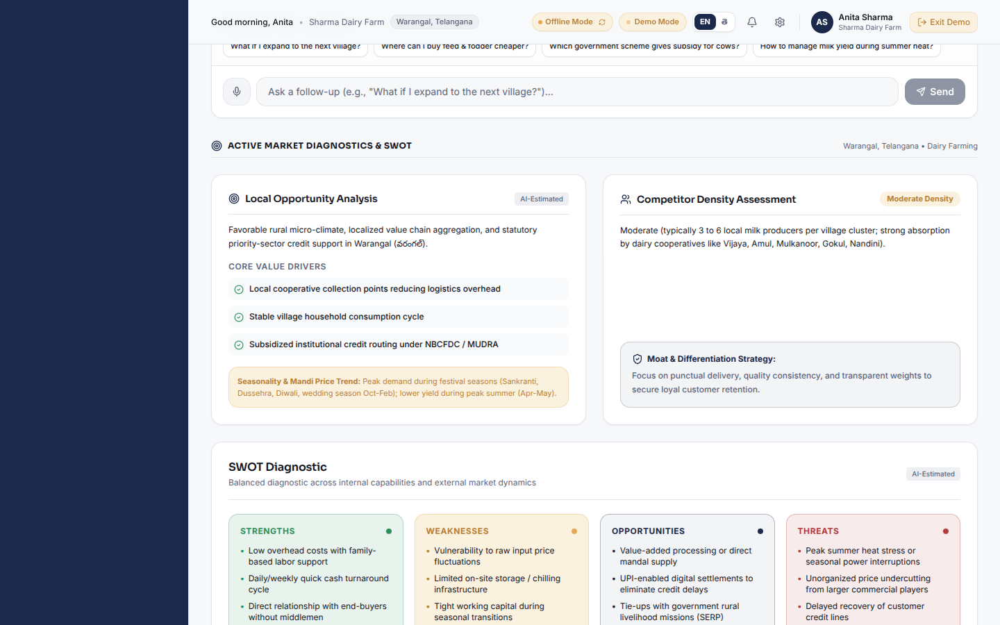
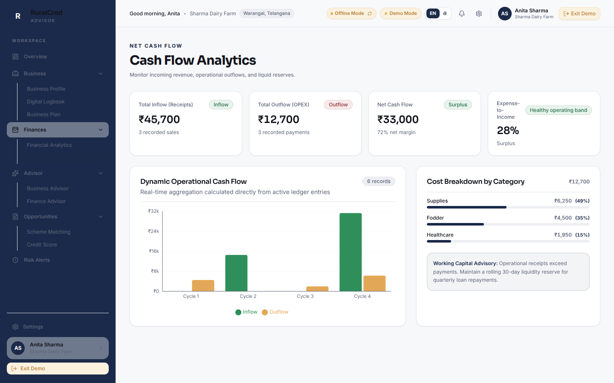
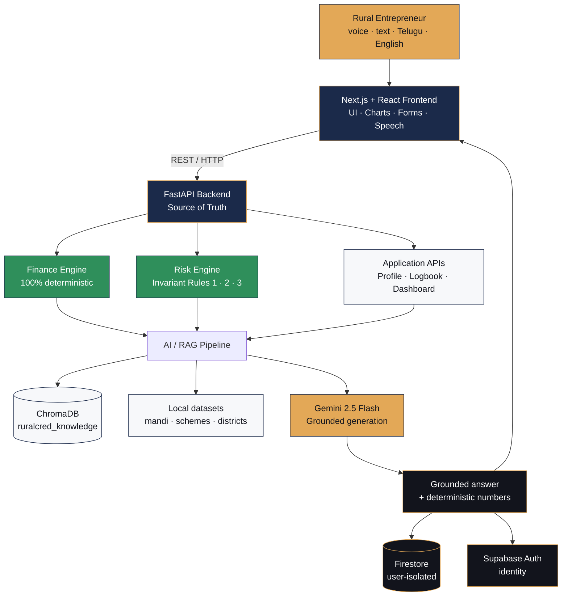

<p align="center">
  <h1 align="center">🌾 RuralCred Advisor</h1>
  <p align="center"><strong>AI-Driven Hyper-Local Business Advisory & Financial Structuring for Rural Micro-Entrepreneurs</strong></p>
  <p align="center"><em>Turning informal, instinct-run rural businesses into credit-ready, data-backed enterprises — in their own language, by voice.</em></p>
</p>

<p align="center">
  
  
  
  
  
  
  
  
  
</p>

<p align="center"><strong>Deterministic finance. Grounded AI advisory. Bilingual, voice-first — built for users banks currently can't see.</strong></p>

---

## ✨ Product Tour

<table>
  <tr>
    <td width="50%" align="center">
      
      <br /><sub><strong>Overview</strong> — financial health, cash-flow intelligence & risk monitor</sub>
    </td>
    <td width="50%" align="center">
      
      <br /><sub><strong>Digital Logbook</strong> — voice, text & OCR entries with Khata ledger</sub>
    </td>
  </tr>
  <tr>
    <td width="50%" align="center">
      
      <br /><sub><strong>Business Advisor</strong> — hyper-local, RAG-grounded recommendations</sub>
    </td>
    <td width="50%" align="center">
      
      <br /><sub><strong>Cash Flow</strong> — income vs expense analytics from real entries</sub>
    </td>
  </tr>
</table>

---

## 📖 Table of Contents

- [The Problem](#-the-problem)
- [Our Solution](#-our-solution)
- [System Architecture](#-system-architecture)
- [Design Philosophy — AI vs Deterministic Logic](#-design-philosophy--ai-vs-deterministic-logic)
- [Core Modules](#-core-modules)
- [Tech Stack](#-tech-stack)
- [Quick Start](#-quick-start)
- [Automated Testing](#-automated-testing)
- [Configuration](#-configuration)
- [API Reference](#-api-reference)
- [Project Structure](#-project-structure)
- [Team](#-team)

---

## 🎯 The Problem

Rural micro-entrepreneurs across India run real businesses — kirana stores, dairy and poultry units, small agri-processing units, tailoring and craft enterprises — almost entirely on instinct. There is no bookkeeping, no credit history, and no structured way to track pricing, cash flow, or profitability.

This isn't a knowledge gap that a generic app can fix. It's a structural exclusion problem:

- **Less than 22% of MSMEs in India have access to formal credit** — data scarcity, not creditworthiness, is the core barrier lenders cite. *(TransUnion CIBIL–SIDBI MSME Pulse Report, July 2026)*
- **Existing advisory tools are generic and national-level.** They ignore the hyper-local factors that actually drive a rural business — local mandi prices, seasonal and festival demand, regional competition, and district-specific government schemes.
- **The result:** entrepreneurs can't access formal credit, can't plan expansion with confidence, and can't even benchmark whether their own business is actually profitable.

Two problems compound each other — no business advisory, and no financial structuring — and neither is solvable in isolation. Bad decisions create cash-flow stress, which pushes entrepreneurs toward informal high-interest lending, which leaves less capital for the business, which leads to worse decisions. Solving only one half of this loop treats a symptom, not the cause.

---

## 💡 Our Solution

**RuralCred Advisor** addresses both halves of that loop in one system — built around the reality of a rural user: low or no literacy, vernacular-first communication, unreliable connectivity, and zero formal financial history.

| Capability | What it means for the user |
|---|---|
| **Digital Logbook** | Converts voice, text, and handwritten ledger entries (via OCR) into structured business records — no behavior change required |
| **AI Business Advisor** | Hyper-local pricing, demand, and timing recommendations, grounded in real local market and scheme data — not generic advice |
| **Deterministic Finance Engine** | Project cost, eligible loan amount, scheme routing, EMI, and full amortization schedules — fixed, auditable formulas, not AI guesswork |
| **Financial Health Score** | Transparent 0–100 score from logging consistency, profit trend, and expense discipline — explainable, not a black box |
| **Rule-Based Risk Engine** | Flags over-leverage, negative cash flow, and downward cash-flow trends before they become a crisis |
| **Scheme Matching** | Matches the entrepreneur's actual profile against real government and NBFC schemes — not generic listings |
| **Bilingual, Voice-First** | Full English/Telugu support with speech recognition and synthesis — literacy is never a barrier |
| **Offline-Resilient** | Core functions remain usable without continuous connectivity |

> **Generative AI explains and advises. It never decides.** Every number that touches a user's money — project cost, loan eligibility, EMI, risk flags, the health score — is computed by deterministic, auditable logic. Gemini (via a RAG pipeline grounded in real local data) only turns that grounded context into clear, conversational advice. The AI is never the single point of failure for a recommendation that affects someone's livelihood.

---

## 🏗️ System Architecture



**Data flow in one line:** user question → conversation context → embedding → ChromaDB retrieval → grounded context → Gemini → query-specific answer → frontend — while every financial number in that answer comes from the deterministic Finance and Risk engines, never from the language model.

Provenance is a first-class concept: **retrieved evidence**, **calculated values**, and **LLM synthesis** are tracked as three separate things, and the system never claims ChromaDB retrieved text it didn't.

---

## ⚖️ Design Philosophy — AI vs Deterministic Logic

| Layer | Type | Why |
|---|---|---|
| Project cost, loan eligibility, EMI, amortization | **Deterministic** | Facts, not predictions — no reason to inject AI uncertainty into arithmetic that affects someone's loan |
| Financial Health Score | **Deterministic** (weighted rules) | Fully explainable to the user and to a judge/regulator — no black-box scoring |
| Risk flags (Rules 1–3) | **Deterministic** | A risk trigger must be reproducible and auditable, not probabilistic |
| Advisory language | **Generative AI** (RAG + Gemini) | Conversational explanation genuinely benefits from an LLM — but only once grounded in real retrieved data |
| Scheme / context retrieval | **Vector similarity** (ChromaDB) | Anchors advice to real local data, not memorized or hallucinated information |

**AI where judgment and language matter. Deterministic logic where facts and money are involved.**

---

## 🧩 Core Modules

### Frontend — Next.js + React + TypeScript

- **Visual design system** — Sora for headings, Inter for body/data; the RuralCred palette:

       

  `ink #12141C` · `indigo #1B2A4A` · `marigold #E3A857` · `growth #2F8F5B` · `alert #B23B3B` · `canvas #F7F8FA`

- **Bilingual support** — instant toggle between English and Telugu (తెలుగు); one active language at a time, no mixed-language labels
- **Voice & accessibility** — Web Speech API for Telugu/English speech recognition and synthesis; receipt/ledger OCR via Tesseract.js
- **Analytics visualization** — Recharts-powered cash-flow, income vs. expense, and category cost views with real-data entrance animations

### Backend — Python + FastAPI (Source of Truth)

**Deterministic Finance Engine**

- `Project Cost = Margin Capital ÷ 0.10`
- `Eligible Loan Amount = 90% of Project Cost`
- **Micro Finance Scheme** (Project Cost ≤ ₹1.40 Lakh): 6.5% p.a., 3-year tenure, 3-month moratorium
- **Term Loan Scheme** (₹1.40 Lakh < Project Cost ≤ ₹50 Lakh): 8.0% p.a., 7-year tenure, 6-month moratorium
- Quarterly reducing-balance EMI formula with full amortization schedule

**Rule-Based Risk Engine**

- `RULE_1` — active loan + second loan simulation (over-leverage alert)
- `RULE_2` — negative net cash flow (expenses exceed receipts)
- `RULE_3` — downward net cash-flow trend (>30% drop from prior cycle)

**Financial Health Score (0–100)**

- 30% logging-habit consistency · 40% net operating profit trend · 30% expense-to-income discipline

**ChromaDB Vector Store & RAG Pipeline**

- Persistent semantic index (`ruralcred_knowledge`) of district demographics, mandi prices, and statutory schemes
- Repeatable ingestion via `python -m app.ingestion.ingest`
- Grounded context passed directly to Gemini (`gemini-2.5-flash`); a strict safety prompt ensures the generative layer never computes finance math or invents data

---

## 🛠️ Tech Stack

| Layer | Technology | Purpose |
|---|---|---|
| Frontend | Next.js + React + TypeScript | App pages, components, state, routing, UI |
| Styling | Tailwind CSS | Responsive styling and the RuralCred visual system |
| Backend | Python + FastAPI | API layer, orchestration, business logic |
| Auth | Supabase Auth | Login, registration, sessions, identity |
| App database | Firebase Firestore | User-isolated persistence — profiles, logbook, state |
| Vector database | ChromaDB | Embedding storage and retrieval for RAG |
| Generative AI | Gemini API (`gemini-2.5-flash`) | Natural-language advisory and conversation |
| AI architecture | RAG | Retrieves grounded knowledge before generation |
| Voice | Web Speech API | Speech recognition (STT) and synthesis (TTS) |
| Charts | Recharts | Income / expense / cash-flow visualization |
| Icons | Lucide React | Professional vector icons — no emojis in the UI |
| OCR | Tesseract.js | Handwritten ledger / receipt text extraction |
| Hosting | Vercel (frontend) · backend host TBD | Delivery |
| Version control | Git + GitHub | Source control and collaboration |

---

## 🚀 Quick Start

### Prerequisites

- Node.js 18+ and npm
- Python 3.10+

### Backend — FastAPI + ChromaDB

```bash
# 1. Navigate to backend and create a virtual environment
cd backend
python -m venv venv

# Windows
.\venv\Scripts\Activate.ps1
# macOS / Linux
source venv/bin/activate

# 2. Install dependencies
pip install -r requirements.txt

# 3. Ingest the local knowledge base into ChromaDB
python -m app.ingestion.ingest

# 4. Start the FastAPI server
uvicorn app.main:app --reload --host 127.0.0.1 --port 8000
```

- Health check → `http://127.0.0.1:8000/health`
- Interactive API docs → `http://127.0.0.1:8000/docs`

### Frontend — Next.js

```bash
# From the repository root
npm install
npm run dev
```

Visit the application at `http://localhost:3000` and continue as a demo user, or sign in.

---

## ✅ Automated Testing

**Backend — Pytest**

```bash
pytest backend/tests -v
```

Verifies micro/term-loan boundaries, quarterly EMI math, zero-balance amortization schedules, deterministic 0–100 health scoring, risk rules 1–3, ChromaDB semantic queries, and logbook user isolation (User A never sees User B's entries).

**Frontend — Typecheck & Build**

```bash
npx tsc --noEmit
npm run build
```

---

## 🔧 Configuration

<details>
<summary><strong>Environment variables</strong> — click to expand</summary>

<br />

Create a `.env` / `.env.local` with the following keys. Never commit this file.

```env
# Gemini API key — required for live AI generation;
# a resilient grounded local fallback is active when absent
GEMINI_API_KEY=<your-gemini-api-key>

# Supabase Auth (optional — a resilient scoped local session is active by default)
NEXT_PUBLIC_SUPABASE_URL=https://your-project.supabase.co
NEXT_PUBLIC_SUPABASE_ANON_KEY=<your-anon-key>

# Firebase Firestore (optional — resilient isolated local storage is active by default)
NEXT_PUBLIC_FIREBASE_API_KEY=<your-firebase-api-key>
NEXT_PUBLIC_FIREBASE_PROJECT_ID=<your-project-id>
```

</details>

---

## 🔌 API Reference

<details>
<summary><strong>Endpoints</strong> — click to expand</summary>

<br />

| Method | Endpoint | Description |
|---|---|---|
| `GET` | `/health` | Health status, ChromaDB connection, Gemini configuration |
| `GET` | `/api/profile` | Retrieve the authenticated user's profile |
| `POST` | `/api/profile` | Create or update the user profile and onboarding status |
| `POST` | `/api/finance/calculate` | Deterministic project cost, scheme routing, EMI, amortization |
| `GET` | `/api/finance/health-score` | Deterministic 0–100 financial health score |
| `POST` | `/api/risk/analyze` | Evaluate deterministic invariant financial risk rules |
| `GET` | `/api/logbook` | List user-scoped logbook transactions |
| `POST` | `/api/logbook` | Add an income or expense transaction |
| `DELETE` | `/api/logbook/{entry_id}` | Delete a transaction |
| `GET` | `/api/dashboard` | Aggregated dashboard — metrics, trends, risks, health score |
| `POST` | `/api/advisor/analyze` | ChromaDB RAG retrieval + Gemini-grounded business advisory |

</details>

---

## 📁 Project Structure

```
ruralCred_Advisor_SIH/
├── app/            # Next.js frontend (pages, routing)
├── backend/        # FastAPI backend (finance engine, risk engine, RAG, APIs)
├── components/     # React components & design system
├── lib/            # Shared frontend utilities (i18n, finance helpers)
├── hooks/          # React hooks
├── context/        # React context providers
├── data/           # Local datasets (mandi prices, schemes, districts)
├── docs/           # Documentation & screenshots
├── scripts/        # Utility scripts
├── test/           # Frontend tests
└── backend/tests/  # Pytest suite
```

---

## 👥 Team

<p align="center">
  <strong>Pixel Scripters</strong><br />
  Dhananjay Sharma · Rao Sankeerth · Granth Jigneshbhai Mangukiya · Medavarapu Saathvik · K. Akshith Kumar
</p>

---

<p align="center">
  <sub>Built for <strong>Smart India Hackathon 2026</strong> — deterministic finance, grounded AI, and dignity-first design for rural micro-entrepreneurs. 🌾</sub>
</p>
