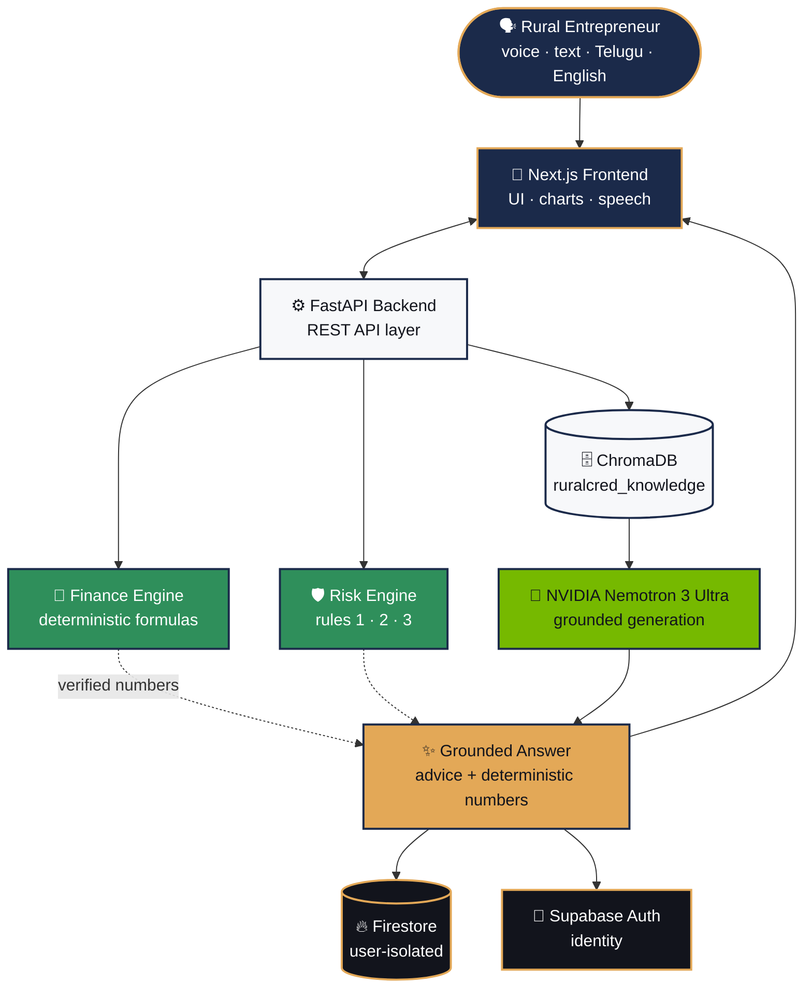

<p align="center">
  
</p>

<p align="center">
  <h1 align="center">🌾 RuralCred Advisor</h1>
  <p align="center"><strong>AI-Driven Hyper-Local Business Advisory & Financial Structuring for Rural Micro-Entrepreneurs</strong></p>
  <p align="center"><em>Turning informal, instinct-run rural businesses into credit-ready, data-backed enterprises — in their own language, by voice.</em></p>
</p>

<p align="center">
  
  
  
  
  
  
  
  
  
</p>

<p align="center">
  
  
  
  
</p>

---

## ✨ Product Tour

<table>
  <tr>
    <td width="50%" align="center">
      
      <br /><sub><strong>Overview</strong> — financial health, cash-flow intelligence & risk monitor</sub>
    </td>
    <td width="50%" align="center">
      
      <br /><sub><strong>Digital Logbook</strong> — voice, text & OCR entries with Khata ledger</sub>
    </td>
  </tr>
  <tr>
    <td width="50%" align="center">
      
      <br /><sub><strong>Business Advisor</strong> — hyper-local, RAG-grounded recommendations</sub>
    </td>
    <td width="50%" align="center">
      
      <br /><sub><strong>Cash Flow</strong> — income vs expense analytics from real entries</sub>
    </td>
  </tr>
</table>

---

## 📖 Contents

- [The Problem](#-the-problem)
- [Our Solution](#-our-solution)
- [System Architecture](#-system-architecture)
- [Design Philosophy](#-design-philosophy)
- [Core Modules](#-core-modules)
- [Tech Stack](#-tech-stack)
- [Quick Start](#-quick-start)
- [Testing](#-testing)
- [Configuration](#-configuration)
- [API Reference](#-api-reference)
- [Project Structure](#-project-structure)
- [Team](#-team)

---

## 🎯 The Problem

Rural micro-entrepreneurs run real businesses — kirana stores, dairy and poultry units, agri-processing, tailoring — almost entirely on instinct. No bookkeeping, no credit history, no way to track pricing, cash flow, or profitability.

This is structural exclusion, not a knowledge gap:

- **< 22% of Indian MSMEs have access to formal credit** — data scarcity, not creditworthiness, is the barrier lenders cite. *(TransUnion CIBIL–SIDBI MSME Pulse Report, July 2026)*
- **Existing tools are generic and national-level.** They ignore what actually drives a rural business — mandi prices, seasonal/festival demand, local competition, district-specific schemes.
- **The loop:** bad decisions → cash-flow stress → informal high-interest lending → less capital → worse decisions. Fixing only one half treats a symptom.

---

## 💡 Our Solution

One system for both halves of the loop — built for low literacy, vernacular-first users, patchy connectivity, and zero financial history.

| Capability | What it does |
|---|---|
| **Digital Logbook** | Voice, text & handwritten (OCR) entries become structured records — no behavior change needed |
| **AI Business Advisor** | Hyper-local pricing, demand & timing advice grounded in real market and scheme data |
| **Deterministic Finance Engine** | Project cost, loan eligibility, scheme routing, EMI & amortization — auditable formulas, never AI guesswork |
| **Financial Health Score** | Transparent 0–100 from logging consistency, profit trend & expense discipline — no black box |
| **Rule-Based Risk Engine** | Flags over-leverage, negative cash flow & downward trends before they become crises |
| **Scheme Matching** | Real government & NBFC schemes matched to the entrepreneur's actual profile |
| **Bilingual, Voice-First** | Full English/Telugu with speech recognition & synthesis — literacy is never a barrier |
| **Offline-Resilient** | Core functions work without continuous connectivity |

> **Generative AI explains and advises. It never decides.** Every number touching a user's money is computed by deterministic, auditable logic. NVIDIA Nemotron 3 Ultra — grounded via RAG on real local data — only turns that context into clear, conversational advice. The AI is never the single point of failure for a livelihood-affecting recommendation.

---

## 🏗️ System Architecture



**One-line data flow:** question → context → embedding → ChromaDB retrieval → grounded context → Nemotron 3 Ultra → answer — with every financial number supplied by the deterministic engines, never the model.

Provenance is first-class: **retrieved evidence**, **calculated values**, and **LLM synthesis** are tracked separately — the system never claims ChromaDB retrieved text it didn't.

---

## ⚖️ Design Philosophy

| Layer | Type | Why |
|---|---|---|
| Project cost, loan eligibility, EMI, amortization | **Deterministic** | Facts, not predictions — no AI uncertainty in arithmetic that affects a loan |
| Health score | **Deterministic** (weighted rules) | Explainable to user, judge, or regulator — no black box |
| Risk flags (Rules 1–3) | **Deterministic** | Reproducible and auditable, not probabilistic |
| Advisory language | **Generative AI** (RAG + Nemotron 3 Ultra) | Conversation benefits from an LLM — but only once grounded in retrieved data |
| Scheme / context retrieval | **Vector similarity** (ChromaDB) | Anchored to real local data, never hallucinated |

**AI where judgment and language matter. Deterministic logic where facts and money are involved.**

---

## 🧩 Core Modules

### Frontend — Next.js + React + TypeScript

- **Design system** — Sora headings, Inter body/data, Lucide icons (zero emojis in the UI):

       

  `ink #12141C` · `indigo #1B2A4A` · `marigold #E3A857` · `growth #2F8F5B` · `alert #B23B3B` · `canvas #F7F8FA`

- **Bilingual** — instant English ⇄ Telugu (తెలుగు) toggle; one active language, no mixed labels
- **Voice & OCR** — Web Speech API (STT/TTS) for Telugu/English; Tesseract.js for handwritten ledgers
- **Analytics** — Recharts cash-flow, income-vs-expense and category views with real-data animations

### Backend — FastAPI (Source of Truth)

**Finance Engine (deterministic)**

- `Project Cost = Margin Capital ÷ 0.10` · `Eligible Loan = 90% of Project Cost`
- **Micro Finance** (≤ ₹1.40L): 6.5% p.a., 3-yr tenure, 3-month moratorium
- **Term Loan** (₹1.40L–₹50L): 8.0% p.a., 7-yr tenure, 6-month moratorium
- Quarterly reducing-balance EMI + full amortization schedule

**Risk Engine** — `RULE_1` over-leverage · `RULE_2` negative cash flow · `RULE_3` >30% downward trend

**Health Score (0–100)** — 30% logging consistency · 40% profit trend · 30% expense discipline

**RAG Pipeline** — persistent `ruralcred_knowledge` index of demographics, mandi prices & schemes (`python -m app.ingestion.ingest`); grounded context fed to Nemotron 3 Ultra via NVIDIA NIM; a strict safety prompt bars the model from computing finance math or inventing data.

---

## 🛠️ Tech Stack

| Layer | Technology | Purpose |
|---|---|---|
| Frontend | Next.js + React + TypeScript | Pages, components, state, routing |
| Styling | Tailwind CSS | The RuralCred visual system |
| Backend | Python + FastAPI | API layer, orchestration, business logic |
| Auth | Supabase Auth | Identity, sessions |
| App DB | Firebase Firestore | User-isolated persistence |
| Vector DB | ChromaDB | RAG embedding storage & retrieval |
| LLM | NVIDIA Nemotron 3 Ultra (via NIM) | Grounded advisory & conversation |
| Voice | Web Speech API | STT + TTS |
| Charts | Recharts | Financial visualization |
| OCR | Tesseract.js | Ledger / receipt extraction |

---

## 🚀 Quick Start

**Prerequisites:** Node.js 18+ · Python 3.10+

```bash
# Backend — FastAPI + ChromaDB
cd backend
python -m venv venv && source venv/bin/activate   # Windows: .\venv\Scripts\Activate.ps1
pip install -r requirements.txt
python -m app.ingestion.ingest                     # build the ChromaDB index
uvicorn app.main:app --reload --host 127.0.0.1 --port 8000
```

Health check → `http://127.0.0.1:8000/health` · API docs → `http://127.0.0.1:8000/docs`

```bash
# Frontend — Next.js (repo root)
npm install
npm run dev          # → http://localhost:3000
```

---

## ✅ Testing

```bash
pytest backend/tests -v     # loan boundaries, EMI math, health score, risk rules, RAG, user isolation
npx tsc --noEmit && npm run build
```

---

## 🔧 Configuration

<details>
<summary><strong>Environment variables</strong></summary>

<br />

```env
# NVIDIA NIM key — live Nemotron advisory; grounded local fallback when absent
NVIDIA_API_KEY=<your-nvidia-key>

# Supabase Auth (optional — scoped local session by default)
NEXT_PUBLIC_SUPABASE_URL=https://your-project.supabase.co
NEXT_PUBLIC_SUPABASE_ANON_KEY=<your-anon-key>

# Firebase Firestore (optional — isolated local storage by default)
NEXT_PUBLIC_FIREBASE_API_KEY=<your-firebase-key>
NEXT_PUBLIC_FIREBASE_PROJECT_ID=<your-project-id>
```

Never commit `.env` / `.env.local` or any keys.

</details>

---

## 🔌 API Reference

<details>
<summary><strong>Endpoints</strong></summary>

<br />

| Method | Endpoint | Description |
|---|---|---|
| `GET` | `/health` | Health, ChromaDB & LLM status |
| `GET` / `POST` | `/api/profile` | Retrieve / create-or-update user profile |
| `POST` | `/api/finance/calculate` | Project cost, scheme routing, EMI, amortization |
| `GET` | `/api/finance/health-score` | Deterministic 0–100 health score |
| `POST` | `/api/risk/analyze` | Invariant risk rules evaluation |
| `GET` / `POST` | `/api/logbook` | List / add user-scoped transactions |
| `DELETE` | `/api/logbook/{entry_id}` | Delete a transaction |
| `GET` | `/api/dashboard` | Metrics, trends, risks, health score |
| `POST` | `/api/advisor/analyze` | RAG retrieval + Nemotron-grounded advisory |

</details>

---

## 📁 Project Structure

```
ruralCred_Advisor_SIH/
├── app/            # Next.js frontend
├── backend/        # FastAPI — finance engine, risk engine, RAG, APIs
├── components/     # React components & design system
├── lib/ · hooks/ · context/
├── data/           # mandi prices, schemes, districts
├── docs/           # docs & screenshots
├── scripts/  test/  backend/tests/
```

---

## 👥 Team

<p align="center">
  <strong>Pixel Engineers</strong><br />
  Dhananjay Sharma · Rao Sankeerth · Granth Jigneshbhai Mangukiya · Medavarapu Saathvik · K. Akshith Kumar · Niteeksha
</p>

---

<p align="center">
  <sub>Built for <strong>THE SMART INDIA HACKATHON (SIH)</strong> — deterministic finance, grounded AI, dignity-first design for rural micro-entrepreneurs. 🌾</sub>
</p>
