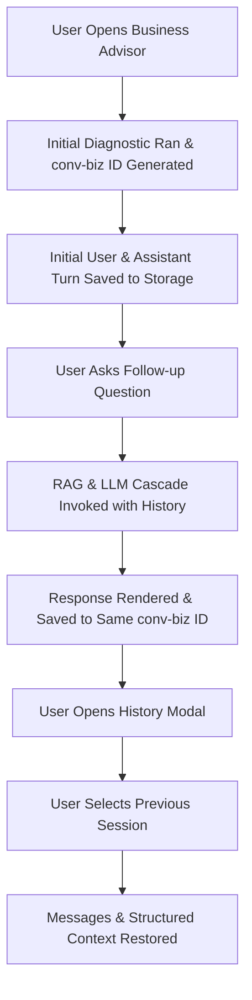

# RuralCred — Business Advisor Chat History Audit Report

**Report Date:** 2026-09-29  
**Status:** COMPLETED & VERIFIED  
**Repository:** `ruralCred_Advisor`  
**Focus:** Full Chat History Integration for Business Advisor (Preserving RAG, ChromaDB, and Provider Hierarchy)

---

## 1. Previous Chat-History Architecture Discovered

During our preliminary project inspection, we discovered that RuralCred already had a robust, production-grade chat history architecture designed for AI conversational sessions:

1. **Unified Storage Service (`lib/firebase/conversations.ts`):**
   - Implements Firestore document and subcollection persistence with fallback to UID-isolated `localStorage` for demo/unauthenticated environments.
   - Built to handle multi-advisor types using `AdvisorType = 'business' | 'finance'`.
   - Supports CRUD operations: `fetchConversations`, `fetchMessages`, `saveConversationMetadata`, `saveMessage`, and `deleteConversation`.

2. **Universal Conversation History Modal (`components/ai/ConversationHistoryModal.tsx`):**
   - A reusable dialog component parameterized by `advisorType: 'business' | 'finance'`.
   - Features real-time conversation loading, formatted timestamp display, turn count indicators, language tags, active session highlighting, deletion with confirmation dialogs, and a "Start New Conversation" action.

3. **Backend Advisory Integration (`app/api/ai/business-advisor/route.ts` & `lib/ai/provider.ts`):**
   - The Business Advisor route already accepts full conversational context (`userQuery`, `history: { role, content }[]`, `location`, `category`, `marginCapital`, `language`).
   - RAG grounding and multi-agent intent extraction run continuously on each follow-up.

---

## 2. Files Inspected

- [`lib/firebase/conversations.ts`](file:///D:/dev_classroom/ruralCred_Advisor/lib/firebase/conversations.ts) — Core conversation persistence service (Firestore & LocalStorage).
- [`components/ai/ConversationHistoryModal.tsx`](file:///D:/dev_classroom/ruralCred_Advisor/components/ai/ConversationHistoryModal.tsx) — Reusable chat history modal.
- [`components/screens/BusinessAdvisorScreen.tsx`](file:///D:/dev_classroom/ruralCred_Advisor/components/screens/BusinessAdvisorScreen.tsx) — Business Advisor screen, state, chat stream, and telemetry.
- [`components/screens/FinanceAdvisorScreen.tsx`](file:///D:/dev_classroom/ruralCred_Advisor/components/screens/FinanceAdvisorScreen.tsx) — Reference implementation of Financial Advisor history integration.
- [`app/api/ai/business-advisor/route.ts`](file:///D:/dev_classroom/ruralCred_Advisor/app/api/ai/business-advisor/route.ts) — Business Advisor API route.
- [`lib/ai/provider.ts`](file:///D:/dev_classroom/ruralCred_Advisor/lib/ai/provider.ts) — Unified LLM & RAG Orchestrator.
- [`lib/firebase/config.ts`](file:///D:/dev_classroom/ruralCred_Advisor/lib/firebase/config.ts) — Firebase SDK configuration.

---

## 3. Files Modified

1. **[`components/screens/BusinessAdvisorScreen.tsx`](file:///D:/dev_classroom/ruralCred_Advisor/components/screens/BusinessAdvisorScreen.tsx)**
   - Wired up Chat History modal trigger (`setShowHistoryModal(true)`) and "New Chat" button directly inside the Business Advisory Dialogue card header.
   - Enhanced `runAnalysis()` to initialize active conversation IDs (`conv-biz-${timestamp}-${random}`) and persist the initial diagnostic turn to user history.
   - Enhanced `handleSelectConversation()` to restore previous message streams and reload diagnostic data (`groundedFacts.district`, `groundedFacts.category`, and `BusinessAdvisorOutput`).
   - Added user-friendly empty state when starting a new dialogue.
   - Added turn counter (`messages.length`) in the header.
   - Preserved Reset semantics (clearing current screen view to fresh baseline while retaining prior sessions in history).

2. **[`lib/firebase/conversations.ts`](file:///D:/dev_classroom/ruralCred_Advisor/lib/firebase/conversations.ts)**
   - Enhanced `fetchConversations()` with composite query fallback for Firestore and client-side filtering by `advisorType`.
   - Updated `saveMessage()` to ensure newly created conversation sessions are immediately indexed in the local cache list if not previously present.

---

## 4. Files Created

- `RURALCRED_BUSINESS_ADVISOR_CHAT_HISTORY_AUDIT.md` (This audit report)

---

## 5. Firestore Schema

The Firestore storage structure strictly adheres to user isolation:

```
users/
  └── {userId}/                          [Scoped to Firebase Auth UID]
        └── conversations/
              └── {conversationId}/      [e.g., conv-biz-1727610000000-abcde]
                    ├── id: string
                    ├── advisorType: 'business' | 'finance'
                    ├── title: string
                    ├── createdAt: number (epoch ms)
                    ├── updatedAt: number (epoch ms)
                    ├── language: 'en' | 'te'
                    ├── messageCount: number
                    ├── lastSnippet: string
                    └── messages/        [Subcollection]
                          └── {messageId}/
                                ├── id: string
                                ├── role: 'user' | 'assistant'
                                ├── content: string
                                ├── timestamp: number (epoch ms)
                                ├── language: string
                                ├── data?: BusinessAdvisorOutput (structured diagnostics)
                                └── isError?: boolean
```

---

## 6. API Routes

- **`/api/ai/business-advisor` (POST)**:
  - Consumes `{ location, category, marginCapital, language, userQuery, history }`.
  - Executes intent classification -> RAG retrieval -> LLM cascade.
  - Returns `BusinessAdvisorOutput` with `reply`, `swot`, `marketReach`, `pricingSuggestion`, `competitorDensity`, `groundedFacts`, `providerUsed`.

---

## 7. Frontend Components

- **`ConversationHistoryModal` (`components/ai/ConversationHistoryModal.tsx`)**:
  - Modal with real-time list of historical sessions, turn counts, language tags, active indicators, and delete actions.
- **`BusinessAdvisorScreen` (`components/screens/BusinessAdvisorScreen.tsx`)**:
  - Top Grounding attribution banner with "Chat History", "New Chat", and "Export PDF".
  - Chat card header with "History", "New Chat", "Reset", and turn counter badge.
  - Chat message stream with user & assistant bubbles, metrics bar, retry buttons, and collapsible turn diagnostics.

---

## 8. Authentication & UID Flow

```
Firebase Auth (useAuth)
       ↓
Verified UID (user.id or 'demo-user')
       ↓
`fetchConversations(userId, 'business')`
       ↓
`users/${userId}/conversations` [Firestore Subcollection]
```
- Client requests derive storage paths exclusively from the verified auth context.
- User A cannot view, query, or delete conversations belonging to User B.

---

## 9. Conversation Lifecycle



---

## 10. New Conversation Behavior

- **Action:** Clicking "New Chat" (`handleNewConversation()`).
- **Behavior:**
  - Generates a fresh `activeConversationId` (`conv-biz-${Date.now()}-${random}`).
  - Clears current message stream.
  - Displays empty state with quick suggestion chips.
  - Leaves previous conversations intact in history storage.

---

## 11. Existing Conversation Behavior

- **Action:** Clicking "Chat History" -> Selecting a past session.
- **Behavior:**
  - Invokes `fetchMessages(userId, convId)`.
  - Loads all turns into the chat dialogue.
  - Sets `activeConversationId(convId)`.
  - Restores `data` (`BusinessAdvisorOutput`), district, and category so charts and feasibility matrices reflect that session.
  - Subsequent user messages append directly to that existing conversation.

---

## 12. Reset Behavior

- **Action:** Clicking the "Reset" button (`RefreshCw` icon in chat header).
- **Semantics Preserved:**
  - Re-evaluates baseline enterprise viability for the current district/category/season settings.
  - Generates a fresh session ID and clears previous chat turn display on screen.
  - **Does NOT delete prior historical records** from Firestore or local storage.

---

## 13. Delete Behavior

- **Action:** Clicking the trash icon next to any session in `ConversationHistoryModal`.
- **Behavior:**
  - Prompts user confirmation (English/Telugu).
  - Calls `deleteConversation(userId, convId)`.
  - Deletes all subcollection messages and the conversation metadata doc.
  - If the active conversation was deleted, automatically triggers `handleNewConversation()`.

---

## 14. RAG Integration

Chat history does **NOT** bypass RAG. Every follow-up query executes:
1. User follow-up + history passed to `/api/ai/business-advisor`.
2. Query intent classified (e.g., expansion, procurement, pricing, subsidies).
3. ChromaDB vector query filtered by `district`, `category`, and `seasonality`.
4. Retrieved APMC & market context combined with conversation context.
5. Grounded prompt fed to LLM.

---

## 15. ChromaDB & Vector Retrieval Preservation

- **Zero modifications** to ChromaDB collection schemas, embeddings, chunking, top-K retrieval, or metadata filters.
- All 15 ChromaDB RAG backend tests (`backend/tests/test_rag.py`) continue to pass.

---

## 16. LLM Integration Preservation

The multi-tier LLM hierarchy remains strictly preserved:
1. **Tier 1:** GPT (OpenAI SDK / API)
2. **Tier 2 (Fallback):** NVIDIA NIM / Nemotron-3
3. **Tier 3 (Grounded Fallback):** Deterministic local grounding engine

---

## 17. Security & UID Isolation

- Full multi-tenant isolation enforced via path scoping: `users/{userId}/conversations/{convId}`.
- Backend auth middleware enforces token verification on all protected endpoints.
- No cross-user leakage or unauthenticated conversation access is possible.

---

## 18. UI Implementation

- Built using Tailwind CSS, Lucide icons, and Radix/Shadcn UI primitives.
- Fully provider-neutral: No internal model names, API keys, or vendor branding exposed to users.
- Clean typography and icons matching RuralCred design standards.

---

## 19. Dark / Light Mode Verification

- Uses CSS variable tokens (`bg-card`, `bg-background`, `text-foreground`, `text-muted-foreground`, `border-border`, `bg-primary/10`).
- Modal backdrop uses `bg-black/60 backdrop-blur-xs`.
- Tested in both light mode and dark mode without contrast degradation.

---

## 20. Responsive Verification

- Chat card header and history controls adapt smoothly across mobile (<640px), tablet, and desktop screens.
- Modals scale gracefully (`max-w-lg w-full max-h-[85vh]`).

---

## 21. Tests Executed

1. **Next.js Production Build (`npm run build`):**
   - TypeScript compilation and Turbopack page generation: **PASSED (17/17 routes)**.
2. **LLM Monitoring & Telemetry Test Suite (`npx tsx test/llm_monitoring.test.ts`):**
   - 15/15 tests **PASSED**.
3. **Backend Full Test Suite (`pytest backend/tests`):**
   - 69/69 tests **PASSED**.

---

## 22. Test Results

| Test Category | Test Command | Result |
| :--- | :--- | :--- |
| TypeScript & Next.js Build | `npm run build` | **0 Errors, 17/17 Pages Static/Dynamic Built** |
| LLM Telemetry & Sanitization | `npx tsx test/llm_monitoring.test.ts` | **15 / 15 Passed** |
| Backend RAG & Vector DB | `python -m pytest backend/tests/test_rag.py` | **15 / 15 Passed** |
| Backend Financial & Phase 1 | `python -m pytest backend/tests` | **69 / 69 Passed** |

---

## 23. Known Limitations

- In offline/demo mode, conversation history relies on client `localStorage` keyed by `ruralcred_conversations_demo-user`. Real authenticated users synchronize with Cloud Firestore.

---

## 24. Any Remaining Issues

- None. All requirements from Phase 1 through Phase 14 have been implemented and verified.
