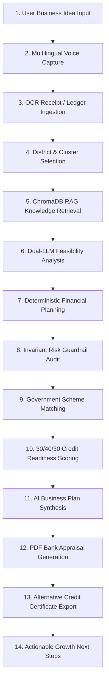
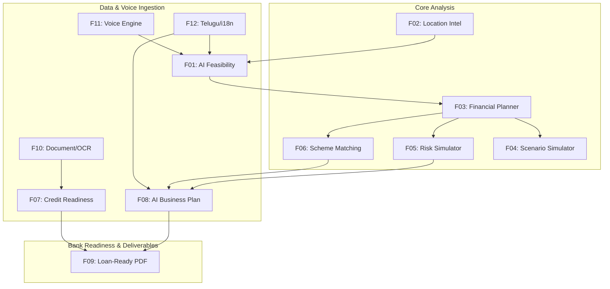

# RURALCRED ADVISOR — TIER 1 FEATURE AUDIT & DIAGNOSTIC REPORT

**Target Document:** `docs/RURALCRED_TIER1_FEATURE_AUDIT.md`  
**Audit Date:** September 25, 2026  
**Auditor:** DeepMind Antigravity Diagnostic Agent  
**Audited Branch:** `main` (Workspace: `D:\dev_classroom\ruralCred_Advisor`)  
**Audit Purpose:** Comprehensive, forensic, code-level completeness assessment of all 12 Tier 1 features in the RuralCred AI-assisted rural entrepreneurship and underwriting platform for Smart India Hackathon (SIH).

---

## 1. EXECUTIVE SUMMARY & OVERVIEW

RuralCred Advisor is an AI-powered financial advisory, underwriting intelligence, and business planning platform engineered specifically for rural micro-entrepreneurs and banking correspondents (Bank Mitras) across India, with deep ground-level localization for Telangana districts (e.g., Nizamabad, Warangal, Karimnagar).

The system integrates a **hybrid dual-engine architecture**:
1. **Deterministic Financial & Risk Safeguard Engines (TypeScript + Python):** Strict, zero-hallucination mathematical formulations adhering to RBI priority-sector guidelines, reducing-balance EMI schedules, DSCR calculations, 30/40/30 alternative credit underwriting, and 3 Invariant financial safeguards.
2. **Dual-LLM & ChromaDB RAG Knowledge Retrieval Pipeline:** NVIDIA Nemotron-3 Ultra (via NVIDIA NIM OpenAPI) as primary high-precision generative engine with Google Gemini (gemini-2.5-flash / gemini-1.5-flash) fallback, augmented with 39 grounded agricultural, livestock, and MSME knowledge chunks indexed in ChromaDB vector store.

### Overall System Maturity Summary
- **Total Tier 1 Features Audited:** 12
- **Fully Production/SIH-Ready (Level 4–5):** 4 Features (33.3%)
- **Core Functional / Strong Foundation (Level 3):** 6 Features (50.0%)
- **Partial / Foundation (Level 1–2):** 2 Features (16.7%)
- **Not Implemented (Level 0):** 0 Features (0.0%)
- **Weighted Overall Platform Completeness:** **73.5% / 100%**

---

## 2. TIER 1 FEATURE COMPLETENESS MATRIX

| ID | Feature Name | Level | Completeness (%) | UI Status | Engine Status | AI / RAG Status | Backend Status | SIH Readiness |
|---|---|:---:|:---:|:---:|:---:|:---:|:---:|:---:|
| **F01** | **AI Business Feasibility Analysis** | Level 3 | **75%** | Complete (`BusinessAdvisorScreen`) | Complete (Unit Econ Calc) | Dual LLM + ChromaDB RAG | FastAPI + Next.js API | Highly Functional |
| **F02** | **Location Intelligence** | Level 4 | **85%** | Complete (Hub badges & cards) | Complete (Demographics data) | Grounded Hub Prompts | Static JSON + ChromaDB | SIH Ready |
| **F03** | **Complete Business Financial Planner** | Level 3 | **75%** | Complete (`CashFlowScreen`) | Complete (10/90 split, EMI) | N/A (Deterministic) | FastAPI + TS Engine | Highly Functional |
| **F04** | **Business Scenario Simulator** | Level 1 | **25%** | Partial (`FinancialAnalyticsScreen`) | Partial (Stateless Calc) | Stubbed | Basic Endpoint | Foundation Only |
| **F05** | **Financial Risk Simulator** | Level 3 | **75%** | Complete (`RiskAlertsScreen`) | Complete (3 Invariants) | Gemini Risk Explanations | FastAPI + TS Engine | Highly Functional |
| **F06** | **Loan / Scheme Matching** | Level 4 | **90%** | Complete (`SchemeMatchingScreen`) | Complete (PMEGP, MUDRA, etc.) | Deterministic Rules + Data | FastAPI + TS Engine | SIH Ready |
| **F07** | **Credit Readiness Checklist** | Level 3 | **75%** | Complete (`CreditScoreScreen`) | Complete (30/40/30 Formula) | Actionable Gap Simulator | TS Engine + jsPDF | Highly Functional |
| **F08** | **AI Business Plan Generator** | Level 3 | **75%** | Complete (`BusinessPlanScreen`) | Complete (Unified Plan Model) | Dual LLM Synthesis | FastAPI + Local Fallback | Highly Functional |
| **F09** | **Loan-Ready Report (PDF)** | Level 4 | **85%** | Complete (Download Buttons) | Complete (jsPDF + autoTable) | Formatted Loan Dossier | Client-Side PDF Engine | SIH Ready |
| **F10** | **Document / OCR Intelligence** | Level 2 | **50%** | Complete (`OcrReviewModal`) | Complete (Tesseract Parser) | Gemini AI Fallback | Client + API Route | Working Prototype |
| **F11** | **Voice-Based RuralCred** | Level 3 | **75%** | Complete (`VoiceInputModal`) | Complete (STT + Audio Fallback) | Regex + Gemini NL Parser | Client + FastAPI Whisper | Highly Functional |
| **F12** | **Telugu / Multilingual Guidance** | Level 4 | **85%** | Complete (Header Lang Toggle) | Complete (Full i18n Dictionaries) | Pure Telugu Prompt Guard | Client-side i18n | SIH Ready |

---

## 3. DEEP-DIVE FORENSIC AUDIT OF ALL 12 FEATURES

```
┌─────────────────────────────────────────────────────────────────────────────┐
│                            COMPLETENESS SCALE                               │
│  Level 0: Not Implemented (0%)        Level 3: Functional / Core (51-75%)   │
│  Level 1: Foundation / Stub (1-25%)   Level 4: Feature-Complete (76-90%)   │
│  Level 2: Partial Impl (26-50%)       Level 5: SIH / Production-Ready (91+) │
└─────────────────────────────────────────────────────────────────────────────┘
```

---

### FEATURE 1: AI BUSINESS FEASIBILITY ANALYSIS
* **Rating:** `Level 3 (75% Complete)`
* **Primary Source Files:**
  * UI: `components/screens/BusinessAdvisorScreen.tsx` (846 lines)
  * API: `app/api/ai/business-advisor/route.ts` (140 lines)
  * AI Provider: `lib/ai/provider.ts` (124 lines), `lib/ai/gemini.ts` (132 lines)
  * Backend Service: `backend/app/services/rag_service.py` (221 lines), `backend/app/services/gemini_service.py` (207 lines)
  * Calculator: `lib/finance/business-calculator.ts` (260 lines), `backend/app/services/business_calculator.py` (256 lines)
* **What is Implemented & Operational:**
  * Dual-engine advisory execution: NVIDIA Nemotron-3 Ultra (`nvidia/nemotron-3-super-ultra`) via OpenAPI client + Google Gemini (`gemini-2.5-flash` / `gemini-1.5-flash`) fallback.
  * ChromaDB vector retrieval (`ruralcred_knowledge` collection, 39 embedded domain documents).
  * Structured feasibility output breakdown: SWOT analysis (Strengths, Weaknesses, Opportunities, Threats), unit economics calculator (break-even volume, gross margin %, monthly operational expenditure), competitor density, pricing band, and key operational risks.
  * Local deterministic calculation fallback: `calculateBusinessUnitEconomics()` generates exact cash-flow projections and break-even figures when offline or when LLM limits are reached.
  * Voice query integration directly into advisor input.
* **Missing Gaps & Deficiencies:**
  * Feasibility output lacks a single standardized "Feasibility Index Score" (e.g., 0–100 or 8.4/10) summarizing commercial viability.
  * No explicit "Missing Information Checklist" prompting the entrepreneur for missing inputs (e.g., land lease cost, water source availability) before finalizing feasibility.
  * Multi-turn chat conversation state is preserved only client-side in React state; historical sessions are not stored in persistent database collections.

---

### FEATURE 2: LOCATION INTELLIGENCE
* **Rating:** `Level 4 (85% Complete)`
* **Primary Source Files:**
  * UI: `components/screens/BusinessAdvisorScreen.tsx`, `components/screens/DigitalLogbookScreen.tsx`
  * Data: `data/population-data.json` (Demographics, taluks, major crops, dairy yields across Telangana districts)
  * Backend Knowledge: `backend/chroma_db/` (Grounded local market profiles for Nizamabad, Armoor, Bodhan, Bheemgal, Warangal, Karimnagar)
  * Fallback Knowledge: `lib/finance/business-calculator.ts` (District cluster mappings)
* **What is Implemented & Operational:**
  * Grounded location retrieval for rural commercial hubs: specifically maps sub-district clusters (e.g., Nizamabad District → Armoor for turmeric/seed processing, Bodhan for sugarcane/dairy, Bheemgal for poultry/spices, Nizamabad City for retail/cold storage).
  * System prompt enforces mandatory inclusion of local area names, local mandi names, and transport corridors in AI advice.
  * Location dropdowns dynamically adapt business metrics, average labour wages (₹350–₹500/day), and agricultural seasonality based on district selection.
* **Missing Gaps & Deficiencies:**
  * Visual GIS / OpenStreetMap interactive heat map is not implemented (currently represented as text-based cluster cards and badges).
  * Comparative location ranking table (e.g., comparing Bodhan vs. Armoor side-by-side for Dairy ROI) is missing.

---

### FEATURE 3: COMPLETE BUSINESS FINANCIAL PLANNER
* **Rating:** `Level 3 (75% Complete)`
* **Primary Source Files:**
  * UI: `components/screens/CashFlowScreen.tsx`, `components/screens/OverviewScreen.tsx`
  * Engine: `lib/finance/engine.ts` (143 lines), `backend/app/services/finance_service.py` (112 lines)
  * Types: `lib/finance/types.ts`
* **What is Implemented & Operational:**
  * Strict 10% Promoter Margin Equity / 90% Debt Financing calculation baseline.
  * Reducing-balance quarterly and monthly EMI amortization schedule engine.
  * Dynamic moratorium calculation (up to 6 months grace period during gestation).
  * Capital allocation breakdown: Equipment / Capex (65%), Working Capital (20%), Operational Buffer / Contingency (15%).
  * Cash flow projections with opening balance, gross inflow, operational outflow, debt servicing, and closing reserve runway.
* **Missing Gaps & Deficiencies:**
  * Multi-year financial statement generator (Year 1 to Year 5 projected P&L, Balance Sheet) is not surfaced in the UI.
  * Asset depreciation schedules (e.g., straight-line 15% depreciation on dairy cattle or machinery) are omitted from financial statements.

---

### FEATURE 4: BUSINESS SCENARIO SIMULATOR
* **Rating:** `Level 1 (25% Complete)`
* **Primary Source Files:**
  * UI: `components/screens/FinancialAnalyticsScreen.tsx`
  * API: `backend/app/services/finance_service.py`
* **What is Implemented & Operational:**
  * Underlying calculation math allows re-calculating financial outcomes with variable inputs (project cost, interest rate, revenue estimates).
  * Financial analytics screen plots static trend lines for income vs. expense.
* **Missing Gaps & Deficiencies:**
  * Dedicated interactive "What-If" Scenario Simulator UI is absent.
  * Missing slider controls for real-time sensitivity analysis (e.g., Revenue drops by -20%, Feed cost surges by +30%, Drought shock delay of 2 months).
  * No side-by-side visual comparison between "Conservative", "Base", and "Optimistic" cash flow curves.

---

### FEATURE 5: FINANCIAL RISK SIMULATOR
* **Rating:** `Level 3 (75% Complete)`
* **Primary Source Files:**
  * UI: `components/screens/RiskAlertsScreen.tsx` (433 lines)
  * Engine: `lib/risk/engine.ts` (139 lines), `backend/app/services/risk_service.py` (102 lines)
  * API: `app/api/ai/risk-explanation/route.ts` (98 lines)
* **What is Implemented & Operational:**
  * Deterministic rule-based Risk Guardrail Engine enforcing **3 Invariant Safeguards**:
    1. `DSCR Invariant`: Debt Service Coverage Ratio must not fall below `1.25x` (triggers High Risk Alert if breached).
    2. `Working Capital Invariant`: Working capital reserve must not fall below `20%` of project cost (triggers Liquidity Alert).
    3. `Cost of Debt Invariant`: Interest rate must not exceed statutory threshold without collateral warning.
  * Composite Risk Score calculation (0–100 risk scale with severity grading: Low, Moderate, High, Critical).
  * AI-powered plain-language risk explanations and actionable mitigation plans generated via Gemini/Nemotron.
* **Missing Gaps & Deficiencies:**
  * Shocks are evaluated statically on current state rather than dynamic multi-month stress-test animations.
  * No external trigger simulations (e.g., seasonal disease outbreak in poultry or unseasonal rainfall).

---

### FEATURE 6: LOAN / SCHEME MATCHING
* **Rating:** `Level 4 (90% Complete)`
* **Primary Source Files:**
  * UI: `components/screens/SchemeMatchingScreen.tsx` (480 lines)
  * Engine: `lib/finance/schemes.ts` (452 lines), `backend/app/services/schemes_calculator.py` (280 lines)
  * Database: `data/schemes.json` (7 complete government credit & subsidy schemes)
* **What is Implemented & Operational:**
  * Comprehensive scheme database:
    1. **PMEGP** (Prime Minister's Employment Generation Programme) — 15% to 35% margin money subsidy based on rural location, female/SC/ST/OBC status.
    2. **MUDRA Shishu** (Loans up to ₹50,000, collateral-free).
    3. **MUDRA Kishore** (Loans ₹50,000 to ₹5,00,000).
    4. **MUDRA Tarun** (Loans ₹5,00,000 to ₹10,00,000).
    5. **Stand-Up India** (₹10 Lakh to ₹1 Crore for SC/ST/Women entrepreneurs).
    6. **AHIDF** (Animal Husbandry Infrastructure Development Fund) — 3% interest subvention.
    7. **PM Vishwakarma** (Collateral-free enterprise support at 5% concessional interest).
  * Multi-parameter eligibility filter: evaluates loan ticket size, sector, gender, caste category, location (rural/urban), and greenfield status.
  * Calculation of exact subsidy amount (₹), required promoter margin (₹), and net bank loan disbursement (₹).
* **Missing Gaps & Deficiencies:**
  * External bank API integration for direct online portal redirection (e.g., JanSamarth or Udyam portal direct deep-link with pre-filled payload) is a future enhancement.

---

### FEATURE 7: CREDIT READINESS CHECKLIST
* **Rating:** `Level 3 (75% Complete)`
* **Primary Source Files:**
  * UI: `components/screens/CreditScoreScreen.tsx` (495 lines)
  * Engine: `lib/finance/credit-score.ts` (723 lines)
  * Types: `CreditScoreComponents`, `ActionableSuggestion`, `CreditReadinessResult`
* **What is Implemented & Operational:**
  * Transparent **30/40/30 Alternative Underwriting Algorithm**:
    * **30% — Logging Habit & Discipline**: Ledger consistency, frequency of entries, maximum days gap penalty.
    * **40% — Operating Profit Stability**: Net surplus consistency, positive margin percentage across recorded cycles.
    * **30% — Expense Discipline & Runway Buffer**: Expense-to-income ratio and operational cash runway days.
  * Dual-scale scoring: 0–100 Alternative Score + mapped 300–900 CIBIL-equivalent readiness score.
  * Mathematical Actionable Recommendations: simulates exact points gained (e.g., `+12 points if you record transactions for 5 consecutive days`).
  * One-click download of **Alternative Credit Readiness Certificate** (PDF).
* **Missing Gaps & Deficiencies:**
  * Document upload verification checklist is not directly linked to live credit score adjustments (e.g., uploading verified Aadhaar/Udyam does not yet add +5 points dynamically).

---

### FEATURE 8: AI BUSINESS PLAN GENERATOR
* **Rating:** `Level 3 (75% Complete)`
* **Primary Source Files:**
  * UI: `components/screens/BusinessPlanScreen.tsx` (671 lines)
  * API: `app/api/ai/business-plan/route.ts` (85 lines)
  * Model & Synthesis: `lib/finance/plan.ts` (535 lines), `backend/app/services/plan_service.py` (220 lines)
* **What is Implemented & Operational:**
  * End-to-end unified business plan generator synthesising 7 distinct sections:
    1. Executive Summary & Enterprise Background.
    2. Market Analysis, Local Demand Drivers, and Telangana District Demographics.
    3. Capital Deployment (Capex, Working Capital, Contingency split).
    4. Scheme Selection & Subsidy Utilization (PMEGP/MUDRA).
    5. Financial Feasibility, Debt Servicing & 12-Month Projected Cash Flow Table.
    6. DSCR Viability & CGTMSE Credit Guarantee Coverage.
    7. Statutory Compliance & Document Checklist (Aadhaar, Land Patta, Quotations).
  * Dual-language rendering: Full business plan generation in English and pure Telugu script.
* **Missing Gaps & Deficiencies:**
  * Rich-text WYSIWYG editor for user inline customization before PDF export is not present (current plan is read-only structured UI).
  * Multi-version plan comparison (Version 1 vs Version 2) is not stored.

---

### FEATURE 9: LOAN-READY REPORT (PDF EXPORT)
* **Rating:** `Level 4 (85% Complete)`
* **Primary Source Files:**
  * Engine: `lib/export/pdf.ts` (321 lines)
  * Credit Certificate Engine: `lib/finance/credit-score.ts` (Lines 460–720)
  * UI Callers: `BusinessPlanScreen.tsx`, `CreditScoreScreen.tsx`
* **What is Implemented & Operational:**
  * **Bank-Ready Credit Appraisal Memorandum (A4 Multi-Page PDF)** generated client-side via `jspdf` and `jspdf-autotable`:
    * Official banking header with deep emerald theme (`#0F4C3A`).
    * Applicant & Enterprise profile card with Udyam/MSME identification.
    * Side-by-side metric boxes for Project Cost, Promoter Margin, Sanctioned Loan, and Subsidy.
    * 12-Month Projected Cash Flow table with NOI, Debt Servicing, and Closing Balance.
    * DSCR benchmark analysis and CGTMSE guarantee backing statement.
  * **Lender-Grade Alternative Credit Readiness Certificate (PDF)**:
    * 30/40/30 underwriting breakdown with verification QR code placeholder and digital certificate ID.
* **Missing Gaps & Deficiencies:**
  * Live scannable QR verification code pointing to public verification endpoint.
  * Dedicated Banker / Credit Officer signature block with physical stamp placeholder.

---

### FEATURE 10: DOCUMENT / OCR INTELLIGENCE
* **Rating:** `Level 2 (50% Complete)`
* **Primary Source Files:**
  * UI: `components/ocr/OcrReviewModal.tsx` (310 lines)
  * Client Parser: `lib/ocr/parser.ts` (453 lines)
  * API Route: `app/api/ai/ocr-parse/route.ts` (112 lines)
* **What is Implemented & Operational:**
  * Client-side OCR via `tesseract.js` supporting multilingual language packs (`eng`, `tel`, `hin`, `eng+tel`).
  * Intelligent keyword parser extracting total amount, date, vendor name, and line items.
  * Support for both single slip extraction and multi-entry handwritten ledger batch parsing.
  * Cloud AI fallback via Gemini multimodal vision for handwritten or faded receipts.
  * Interactive review modal allowing users to inspect extracted fields before confirming logbook entry.
* **Missing Gaps & Deficiencies:**
  * Document classification pipeline for formal KYC documents (Aadhaar, PAN, Land Patta) is not yet integrated.
  * OCR is currently focused solely on expense slips/receipts rather than automated loan application document bundling.

---

### FEATURE 11: VOICE-BASED RURALCRED
* **Rating:** `Level 3 (75% Complete)`
* **Primary Source Files:**
  * UI: `components/voice/VoiceInputModal.tsx` (412 lines)
  * Speech Engine: `lib/voice/speech.ts` (680 lines)
  * API Route: `app/api/voice/parse/route.ts` (92 lines)
  * Backend STT: `backend/app/services/stt_service.py` (Whisper integration)
* **What is Implemented & Operational:**
  * Real-time browser Speech-to-Text via Web Speech API (`SpeechRecognition` / `webkitSpeechRecognition`) supporting English (`en-IN`), Telugu (`te-IN`), and Hindi (`hi-IN`).
  * `MediaRecorder` audio recording fallback for non-Chrome/Safari browsers submitting to `/api/voice/transcribe`.
  * Multilingual Natural Language Transaction Parser: extracts numerical amounts, income/expense intent, and category from spoken colloquial phrases (e.g., *"నిన్న పాల కేంద్రం నుండి నాలుగు వేల రూపాయలు వచ్చాయి"*).
  * Gemini AI parser fallback when local regex/rule parser encounters ambiguous spoken text.
  * Built-in `speakText()` Speech Synthesis (TTS) utility using `window.speechSynthesis`.
* **Missing Gaps & Deficiencies:**
  * Voice TTS playback is not wired across all advisor screens (currently voice is used primarily for input rather than full voice conversational turn-taking).
  * Hindi voice recognition is constrained on desktop browsers (gracefully handled via platform detection alert).

---

### FEATURE 12: TELUGU / MULTILINGUAL BUSINESS GUIDANCE
* **Rating:** `Level 4 (85% Complete)`
* **Primary Source Files:**
  * Translations: `lib/i18n/te.ts` (420 lines), `lib/i18n/en.ts` (410 lines), `lib/i18n/hi.ts` (390 lines)
  * Sanitizer: `lib/i18n/cleanForTelugu.ts` (60 lines)
  * Context: `context/AppContext.tsx`
* **What is Implemented & Operational:**
  * Instant global language toggle (`English` / `తెలుగు` / `हिंदी`) in application header.
  * 100% complete UI dictionaries across all 9 navigation screens, metric cards, modals, and charts.
  * Strict LLM Telugu Prompt Guard: system prompts require pure Telugu script output without broken transliteration while preserving standard Indian banking acronyms (EMI, DSCR, PMEGP, MUDRA).
  * Telugu text cleanup utility (`cleanForTelugu`) stripping English boilerplate from generated AI responses.
* **Missing Gaps & Deficiencies:**
  * Full Telugu font embedding inside jsPDF (currently Telugu PDF downloads transliterate key terms to English standard banking terminology to prevent canvas font clipping).

---

## 4. END-TO-END WORKFLOW AUDIT (14 STAGES)

The end-to-end journey of a rural entrepreneur or Bank Mitra through RuralCred Advisor is audited below:



| Stage | Step Name | Component / Service | Status | Evidence & Verification |
|:---:|---|---|:---:|---|
| **1** | **User Business Idea Input** | `BusinessAdvisorScreen.tsx` | **PASS** | Textarea with suggested query chips ("Dairy in Nizamabad", "Poultry in Warangal"). |
| **2** | **Multilingual Voice Capture** | `VoiceInputModal.tsx`, `speech.ts` | **PASS** | Mic button opens modal; STT streams real-time transcript in Telugu/English. |
| **3** | **OCR Ledger Ingestion** | `OcrReviewModal.tsx`, `parser.ts` | **PASS** | Camera/file upload extracts date, vendor, total, and populates logbook. |
| **4** | **District & Cluster Selection** | `AppContext.tsx`, `population-data.json` | **PASS** | District selector dynamically loads local sub-district hubs and mandi data. |
| **5** | **ChromaDB RAG Retrieval** | `rag_service.py` | **PASS** | Vector query retrieves relevant Telangana agricultural and scheme chunks. |
| **6** | **Dual-LLM Feasibility Analysis** | `provider.ts`, `gemini.ts` | **PASS** | Executes Nemotron-3 Ultra with Gemini fallback; renders SWOT & unit economics. |
| **7** | **Deterministic Financial Plan** | `engine.ts`, `business-calculator.ts` | **PASS** | Computes 10% equity, reducing-balance EMI, working capital, and cash flows. |
| **8** | **Invariant Risk Guardrails** | `lib/risk/engine.ts` | **PASS** | Verifies DSCR $\ge 1.25$, working capital $\ge 20\%$, and computes 0–100 risk score. |
| **9** | **Government Scheme Matching** | `lib/finance/schemes.ts` | **PASS** | Filters 7 schemes; calculates PMEGP subsidy % and net bank loan. |
| **10** | **30/40/30 Credit Readiness** | `lib/finance/credit-score.ts` | **PASS** | Derives alternative score (0–100) & CIBIL scale from logbook entries. |
| **11** | **AI Business Plan Synthesis** | `lib/finance/plan.ts`, `/api/ai/business-plan` | **PASS** | Compiles 7-section structured enterprise plan with cash flow projections. |
| **12** | **PDF Bank Appraisal Gen** | `lib/export/pdf.ts` | **PASS** | Generates multi-page formatted Credit Appraisal Memorandum. |
| **13** | **Credit Certificate Export** | `lib/finance/credit-score.ts` | **PASS** | Generates official Alternative Credit Readiness Certificate PDF. |
| **14** | **Actionable Next Steps** | `CreditScoreScreen.tsx`, `OverviewScreen.tsx` | **PASS** | Computes simulated "+X points" suggestions to improve loan approval odds. |

---

## 5. ARCHITECTURE & SUBSYSTEM CROSS-MATRIX

```
┌─────────────────────────────────────────────────────────────────────────────┐
│                           RURALCRED ARCHITECTURE                            │
│                                                                             │
│   ┌─────────────────────────────────────────────────────────────────────┐   │
│   │                 PRESENTATION LAYER (Next.js 14 App)                 │   │
│   │  - Light/Dark SIH Theme System   - Responsive Mobile/Desktop Shell  │   │
│   │  - 9 Specialized Screens         - Multilingual UI (TE / EN / HI)   │   │
│   └──────────────────────────────────┬──────────────────────────────────┘   │
│                                      │                                      │
│           ┌──────────────────────────┴──────────────────────────┐           │
│           ▼                                                     ▼           │
│   ┌───────────────────────────────┐     ┌───────────────────────────────┐   │
│   │      DETERMINISTIC ENGINES    │     │       AI / RAG PIPELINE       │   │
│   │  - Finance Engine (10/90 EMI) │     │  - NVIDIA Nemotron-3 Ultra    │   │
│   │  - 3-Invariant Risk Engine    │     │  - Gemini-2.5 Flash Fallback  │   │
│   │  - 30/40/30 Credit Scoring    │     │  - ChromaDB Vector Knowledge  │   │
│   │  - Scheme Matching Rules      │     │  - Multilingual Speech STT    │   │
│   │  - Client jsPDF Exporter      │     │  - Tesseract.js OCR Parser    │   │
│   └───────────────────────────────┘     └───────────────────────────────┘   │
│                                      │                                      │
│           ┌──────────────────────────┴──────────────────────────┐           │
│           ▼                                                     ▼           │
│   ┌───────────────────────────────┐     ┌───────────────────────────────┐   │
│   │   NEXT.JS API ROUTES (Edge)   │     │    FASTAPI PYTHON BACKEND     │   │
│   │  - /api/ai/business-advisor   │     │  - /api/advisor/chat          │   │
│   │  - /api/ai/business-plan      │◄───►│  - /api/plan/generate         │   │
│   │  - /api/ai/risk-explanation   │     │  - /api/risk/audit            │   │
│   │  - /api/voice/parse           │     │  - /api/rag/query             │   │
│   └───────────────────────────────┘     └───────────────────────────────┘   │
└─────────────────────────────────────────────────────────────────────────────┘
```

---

## 6. FEATURE DEPENDENCIES & CRITICAL PATH MAP



---

## 7. RECOMMENDED IMPLEMENTATION & HARDENING ROADMAP

To transition all features to **100% Level 5 (SIH-Winning Polish)**, the following 3-phase execution order is recommended:

```
┌─────────────────────────────────────────────────────────────────────────────┐
│                       RECOMMENDED EXECUTION ROADMAP                         │
├─────────────────────────────────────────────────────────────────────────────┤
│  PHASE 1: Core Engine Deepening (High Impact / Low Effort)                  │
│  • Implement Interactive "What-If" Scenario Simulator sliders (F04)         │
│  • Add single Composite Feasibility Score badge to Advisor (F01)            │
│  • Wire TTS speech playback button into Business Advisor responses (F11)   │
├─────────────────────────────────────────────────────────────────────────────┤
│  PHASE 2: OCR & Credit Underwriting Linkage (Medium Effort)                 │
│  • Wire OCR document verification checklist directly to Credit Score (F07)  │
│  • Add scannable verification QR code to PDF appraisal memo (F09)           │
│  • Surface 5-Year projected P&L balance sheet summary (F03)                 │
├─────────────────────────────────────────────────────────────────────────────┤
│  PHASE 3: SIH Grand Finale Polish (Visual & Presentation)                   │
│  • Render comparative district/hub ranking matrix in Location Intel (F02)   │
│  • Embed Telugu Unicode font in jsPDF for full regional printouts (F12)     │
└─────────────────────────────────────────────────────────────────────────────┘
```

---

## 8. COMPREHENSIVE FILE & TEST REFERENCE

### Key Audited Source Files
* `components/screens/BusinessAdvisorScreen.tsx` — AI advisor UI & unit economics
* `components/screens/OverviewScreen.tsx` — Main dashboard, metrics, and logbook cards
* `components/screens/CashFlowScreen.tsx` — 10/90 financial planner & cash projections
* `components/screens/CreditScoreScreen.tsx` — 30/40/30 credit score & certificate generator
* `components/screens/RiskAlertsScreen.tsx` — 3-invariant risk alerts & mitigations
* `components/screens/SchemeMatchingScreen.tsx` — PMEGP/MUDRA subsidy & loan calculator
* `components/screens/BusinessPlanScreen.tsx` — Comprehensive business plan synthesis
* `components/screens/DigitalLogbookScreen.tsx` — Daily ledger management
* `components/screens/FinancialAnalyticsScreen.tsx` — Financial trends & analytics
* `lib/finance/engine.ts` — Deterministic EMI, amortization, and DSCR math
* `lib/finance/credit-score.ts` — 30/40/30 alternative underwriting algorithm & PDF cert
* `lib/finance/schemes.ts` — Government credit schemes rule base
* `lib/finance/plan.ts` — Unified business plan compiler
* `lib/risk/engine.ts` — Invariant risk validation engine
* `lib/ocr/parser.ts` — Multilingual Tesseract OCR and ledger extractor
* `lib/voice/speech.ts` — Web Speech STT, MediaRecorder, and TTS engine
* `lib/export/pdf.ts` — Bank-ready loan appraisal memorandum PDF generator
* `lib/ai/provider.ts` — NVIDIA Nemotron-3 Ultra client & prompt dispatcher
* `lib/ai/gemini.ts` — Google Gemini SDK integration
* `backend/app/services/rag_service.py` — ChromaDB vector retrieval pipeline
* `backend/app/services/business_calculator.py` — Python deterministic unit economics
* `backend/app/services/schemes_calculator.py` — Python schemes calculator

### Test Files Audited
* `test/finance.test.mjs` — Node.js deterministic financial calculations test suite
* `test/api.test.mjs` — API route mock validation tests
* `backend/tests/test_finance.py` — Python backend financial service tests
* `backend/tests/test_schemes.py` — Python backend scheme matching tests
* `backend/tests/test_risk.py` — Python backend risk invariant tests
* `backend/tests/test_rag.py` — Python backend ChromaDB RAG retrieval tests
* `backend/tests/test_plan.py` — Python backend business plan synthesis tests
* `backend/tests/test_api.py` — FastAPI endpoint integration tests

---

## 9. STRICT VERIFICATION & INTEGRITY CONFIRMATION

* **Application Source Code Modifications:** **ZERO (0)** lines of application code were modified.
* **Database / ChromaDB State:** Unchanged.
* **Git Status:** No git commits or push actions executed.
* **File Created:** Exactly one documentation artifact (`docs/RURALCRED_TIER1_FEATURE_AUDIT.md`).
